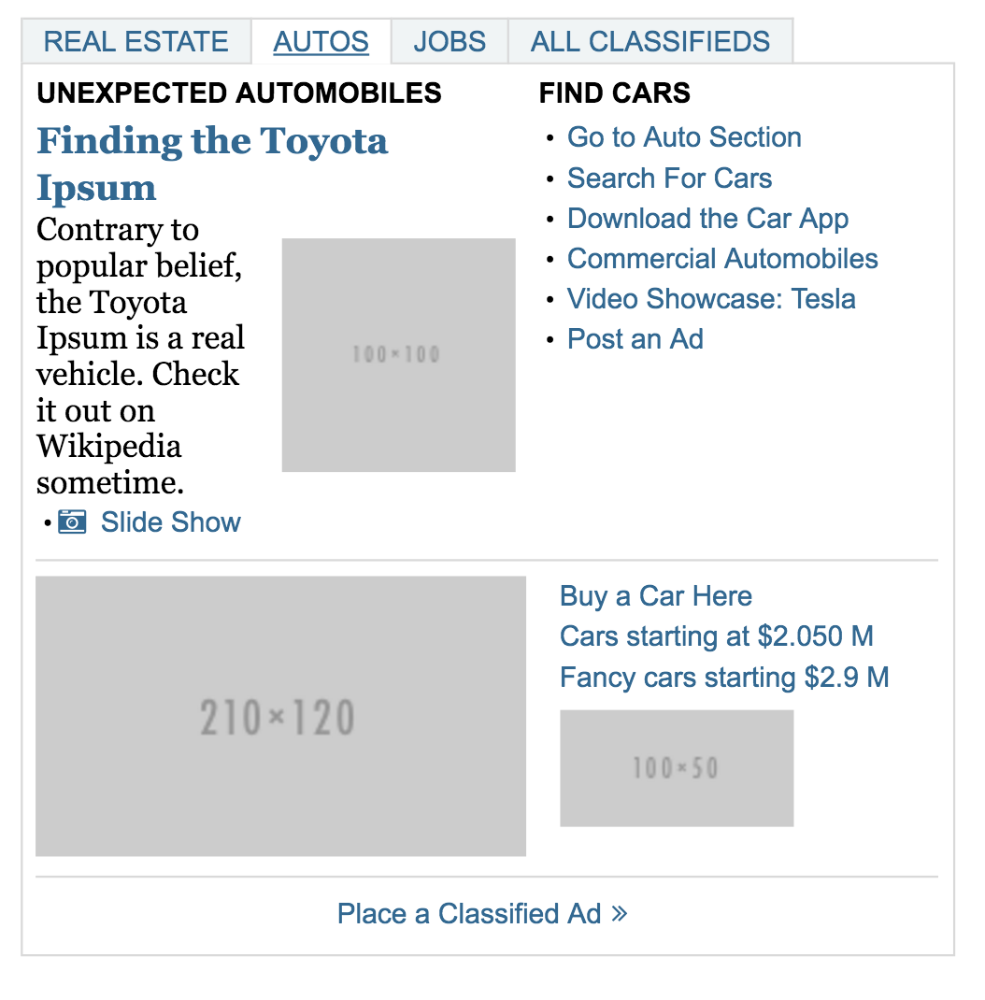

#Front ­End Developer Code Screen

##1. React Component: NYTimes Classifieds

Recreate the New York Times’ classifieds component using React. Make sure clicking on the tabs works and opens new content (you can use filler text). Include screenshots with your code.

**The provided mock:**


##The results:

**To start the app:**

1. `npm install`
2. `npm start`

**Screenshot 1:**

**Screenshot 2:**


##2. Algorithm: Amoeba Population

Write a method, ```populationGrowth(simulationLength)```, that determines how many amoebas will exist after simulationLengthgiven the scenario below. It is preferable to write the method using javascript. Attach any extra/scratch work you may have used to solve.

**Premise:**

* At year 0 a baby amoeba is added to the new population.
* At the turn of each following year a new population is created following these rules:
	1. An adult amoeba will exist in the new population and add a new baby amoeba to new
population
	2. A baby amoeba will exist in the new population as an adult amoeba
Given simulationLengthhow many amoebas will exist after simulationLengthyears?

e.g.:

**Year 0:**

	a

**Year 1:**

	A

**Year 2:**

	A
	|
	a

**Year 3:**

	  A
	 / \
	A 	a

**Year 4:**

	   _ A _
	  /  |  \
	 A   A   a
	 |
	 a


